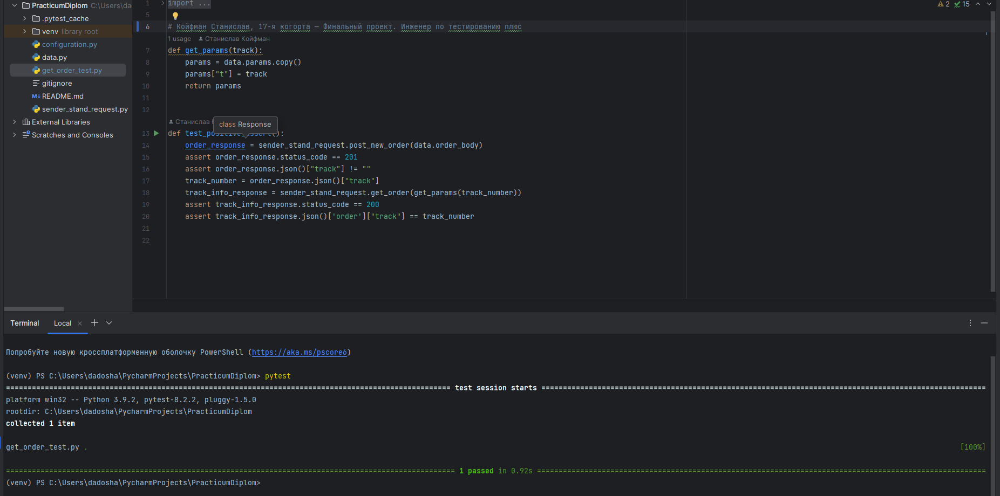

# Работа с базой данных
## Задание 1
Представь: тебе нужно проверить, отображается ли созданный заказ в базе данных.
Для этого: выведи список логинов курьеров с количеством их заказов в статусе «В доставке» (поле ```inDelivery = true```). 

## Решение
```
SELECT c.login,
       COUNT(o.track)
FROM "Couriers" AS c
LEFT OUTER JOIN "Orders" AS o ON c.id = o."courierId"
WHERE o."inDelivery" = TRUE
GROUP BY c.login;
```

## Задание 2
Ты тестируешь статусы заказов. Нужно убедиться, что в базе данных они записываются корректно.

**Для этого: выведи все трекеры заказов и их статусы.** 

Статусы определяются по следующему правилу:

Если поле ```finished == true```, то вывести статус ```2```.

Если поле ```canсelled == true```, то вывести статус ```-1```.

Если поле ```inDelivery == true```, то вывести статус ```1```.

Для остальных случаев вывести ```0```.

## Решение
```
SELECT track,
       CASE
           WHEN finished = TRUE THEN 2
           WHEN "cancelled" = TRUE THEN -1
           WHEN "inDelivery" = TRUE THEN 1
           ELSE 0
       END AS status
FROM "Orders";
```
# Автоматизация теста к API
Теперь автоматизируй сценарий, который подготовили коллеги-тестировщики:
1. Клиент создает заказ.
2. Проверяется, что по треку заказа можно получить данные о заказе.

**Шаги автотеста:**
1. Выполнить запрос на создание заказа.
2. Сохранить номер трека заказа.
3. Выполнить запрос на получения заказа по треку заказа.
4. Проверить, что код ответа равен 200.

## Решение
